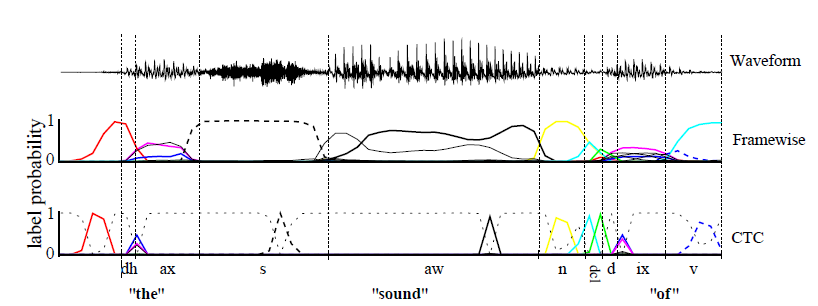

# 背景{#Background}


纯基于神经网络的语音识别有弊端：训练的过程中我们需要对于每一个音素或每一个帧或每一个时间段上对应的输入来很好的对应好输出，这样就会产生两个主要的问题：

+ 训练数据要预分割成与标签对应（也就是我们说的文本语音对其）(对齐很繁琐并且不准确)

+ 这样训练出来的是局部分类任务，序列的全局方面，例如两个标签的可能性
连续出现，必须外部建模。事实上，没有某种形式的后处理，最终标签序列不能被可靠地推断。

因此CTC（Connectionist temporal classification）就应运而生啦。

为什么CTC就不需要去对齐语音和文本呢？因为CTC它允许我们的神经网络在任意一个时间段预测label，只有一个要求：就是输出的序列顺序只要是正确的就ok啦~这样我们就不在需要让文本和语音严格对齐了，而且CTC输出的是整个序列标签，因此也不需要我们再去做一些后处理操作。

图1.1说明了CTC和framewise在语音识别应用中的区别。

```{r fig.align = 'center',out.width = "100%",echo=FALSE,fig.cap="CTC and framewise classification networks applied to a speech signal"}


```

有色线条是输出激活，对应于特定时间观察音素的概率。CTC网络只预测音素序列(通常为一系列尖峰，由“空白”，或空预测分隔，其概率以灰虚线表示。)然而framewise网络试图将它们与手动分割（垂直线）对齐。
