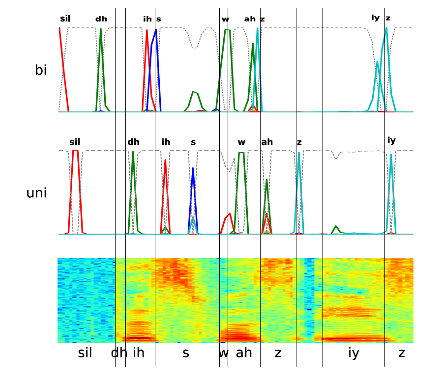

# 从输出到标签{#From-Outputs-to-Labellings}

## 符号表示

+ $y_k^t$ 表示输出序列在第 $t$ 步的输出为 $k$ 的概率,举个简单的例子：(a-ab-),$y_a^3$ 表示在第3步输出的字母为a的概率

+ $p(\pi|x)$ 表示给定输入 $x$，输出为路径 $\pi$的概率。

假设在每个时间步输出的label的概率是相互独立的或条件独立的，那么$p(\pi|x)$ 可以用公式是表示：$p(\pi|x)=\prod_{t=1}^T(y_{\pi_t}^t)$,可以理解为每一个时间步输出路径为$\pi_t$的相应label的概率乘积。

+ $F$： 代表多对一的映射，将输出路径 $\pi$ 映射到标签序列 $l$的一种变换，这里忽略掉重复的label和空格，即 $F(a-aab-)=F(-aa-abb)=aab$


+ $p(l|x)$：表示给定输入$x$，输出序列$l$的概率，因此输出序列$l$的概率可以表示为所有输出的路径 $\pi$映射后的序列为 $l$ 的概率之和(因为路径之间是互斥的)，公式表示为：
$$p(l|x) = \sum_{\pi \in F_{(l)}^{-1}}p(\pi|x)$$


在同一个标签上折叠不同的路径，使得CTC使用未分段的数据成为可能，因为他允许网络预测标签而不事先知道他们发生的位置。这样在理论上使得CTC不适合必须事先确定标签的任务，而实际上从很多例子上发现CTC对于位置的预测也很准确。


## 空格的作用

最开始的CTC设定中是没有空格的，$F$只是简单的溢出了连续的相同字母，但是这样会产生两个问题：

+ 无法预测出连续两个相同的字母的单词了，比如说hello这个单词，在CTC中会删除掉连续相同的字母，因此CTC最后预测出的label应该是helo

+ 无法预测出一句完整的话，而只能预测单个的单词。因为缺乏空格，CTC无法表示出单词与单词之间停顿的部分，因此只能预测出单个单词，或者将一句话中的单词全部连接起来了(这是对于英文而言)


因此，空格在CTC中的作用还是十分重要的。


## 双向或单向网络

假设CTC中使用的标签概率被假设为条件在整个输入序列上，喜欢双向(eg.BLSTM)RNN体系结构似乎是自然的。如果网络是单向的,在t时刻的label的概率只依赖于t时刻的输入。因此，在生成相应的标签之前，网络必须等到给定的输入段完成后（或至少充分地被识别）才可以。回想一下，对于framewise分类，对于每个输入具有单独的目标，将未来上下文合并到单向网络中的一种方式是在输入和目标之间引入延迟。单向CTC网络要更好一些，因为延迟不是固定的，而是可以由网络根据被标记的段来选择。在真实的应用场景中，使用单向的而非双向的网络造成的性能损失，CTC确实要比framewise要小。这对于应用（如实时语音识别）来说是值得考虑的，因为在这种场景下双向RNN可能是不适用的或不可能应用的。图2.1反映了单向和双向CTC网络的一些不同。

```{r fig.align = 'center',out.width = "100%",echo=FALSE,fig.cap="Unidirectional and Bidirectional CTC Networks"}


```

+ 谱图（底部）代表话语的开始，其中由垂直黑线标记的手分段音素边界，以及下方的正确的语音标签。

+ 输出音素概率由实线表示，而虚线则对应于“空白”概率。

+ 单向网络（中间）和双向网络（上方）都成功地标记数据。

+ 然而，它们在不同时期发出标签。

+ 而单向网络必须等到相应的段完成后（例外是‘sil’和‘s’，大概是因为它们需要较少的上下文来识别）,双向网络可以在分段之前、之后或期间发射标签。

+ 另一个重要的特点是双向CTC网络，善于把一些频繁协同发生的词粘合在一起(比如这里的‘ah'和“z”，他们结合在“was”的押韵声中)