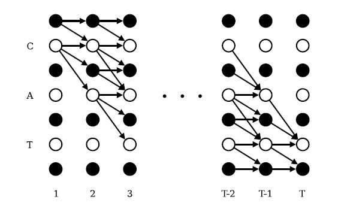
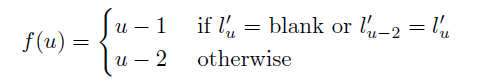
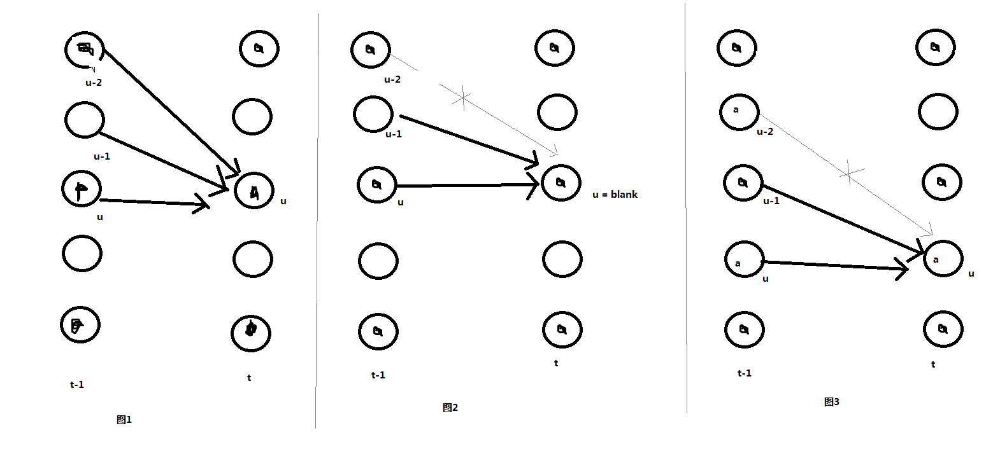
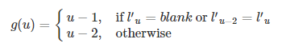

# 前向传播与反向传播 {#Forward-Backward-Algorithm}

我们来看一下CTC是怎样训练的......

在对符号做了一些定义之后，我们接下来看看CTC的前向传播的过程。我们前向传播就是要去计算 $p(l|x)$ 由于一个序列 $l$ 通常可以有多条路径经过映射后得到，而随着序列 $l$ 长度的增加，相对应的路径的数目是成指数增加的，因此我们需要一种高效的算法来计算它。

有一种类似于HMM的前向传播的算法可以帮助我们来解决这个问题。它的关键点就是那些与序列 $l$ 对应的路径概率都可以通过迭代来计算得出。

## 前向传播

对于一个特定的序列$l$ ，我们定义前向变量$\alpha(t,u)$为输出所有长度为$t$，且经过$F$ 映射之后为序列$l$ 的路径的概率之和，用公式表达如下所示：
$$\alpha(t,u)=\sum_{\pi \in V(t,u)}\prod_{i=1}^{t}y_{\pi_i}^{i}$$
其中$V(t,u)=\{\pi \in A^{'T}:F(\pi)=l_{1:u/2},\pi_t=l_u^{'}\}$ 代表了所有满足经过 $F$ 映射之后为序列$l$ ，长度为t的路径集合，且在第t时间步的输出为label: $l_u^{'}$.注意这里的$l^{'}$是对$l$进行空白插入得到的，且插入后的维度定义为$U^{'}=2U+1$,其中$U$表示$l$的长度。

正如我们将看到的，在时间t的前向变量可以从时间t-1的递归计算。


所有正确路径的开头必须是空格或者label：$l_1$，因此存在着初始化的约束条件：

$$\alpha(1,1) = y_b^1$$

$$\alpha(1,2) = y_{l_1}^1$$

$$\alpha(1,u) = 0 \quad \forall u>2$$

我们通过下图去理解这个过程：


```{r fig.align = 'center',out.width = "150%",echo=FALSE,fig.cap="CTC forward-backward algorithm"}


```

上图中，白色的点表示一个label，黑色的点表示空格，纵向每一列表示的是路径的长度T（或者时刻T），箭头代表了路径下一个时刻可以输出到哪个label去。如果在时刻 1 的 label 为空格，那么路径在下一时刻只有两个选择，第一个还是输出空格，第二个就是输出序列 $l_1$ 中对应的空格的下一个label：C；如果在时刻2的 label 为 C，那么在时刻3，它可以有三种选择：第一种就是输出还是 C，第二种是输出为空格，第三种是直接输出A。

从上图可以看出长度为T的输出路径映射到序列 $l$：cat， 可以由第T步为label：t(cat中的字母t)的所有路径和第T步为空格的所有路径的概率之和来表示。

因此,$p(l|x)$可以由前向变量来表示，即为

$$p(l|x)=\alpha(T,U^{'})+\alpha(T,U^{'}-1)$$

其中$\alpha(T,U^{'})$可以理解为所有路径长度为$T$，经过$F$映射之后为序列$l$,并且第$T$时刻的输出的label为$l^{'}_U$或者$l^{'}_{U-1}$。也就是路径的最后一个是否包含了空格。


现在我们来引出其推导公式：

$$\alpha(t,u)=y_{l^{'}_u}^t\sum_{i=f(u)}^u\alpha(t-1,i)$$


其中

```{r fig.align = 'center',echo=FALSE,out.width="150%"}


```

```
$$
\begin{equation}
f(u)=\left\{
\begin{aligned}
& u-1  & if \quad l_u^{'}=blank \quad or \quad l_{u-2}^{'}=l_u^{'}\\
& u-2 & otherwise \\
\end{aligned}
\right.
\end{equation}
$$
```


如何理解这个递推公式呢，很简单，我们可以看下面递推图，就以时刻T为空格的前向变量为例，由于我们之前讲过了如果当前时刻的输出为空格，下一时刻路径输出只有两种可能性，而如果我们当前时刻是空格，上一时刻的输出从图中可以看出也是由两种可能性，一种是在T-1时刻输出为空格，另外一种是在T-1时刻输出为T。因此我们只要计算出T-1时刻输出为空格的所有正确路径的概率之和以及在T-1时刻输出为T的所有路径的概率之和，再乘上T时刻输出为空格的概率 $y_{l_u^{'}}^t$，就可以得到前向变量$\alpha(t,u)$。时刻T为label：T的前向变量的求法和空格的类似，只是它由三种可能情况求和再乘上 $y_{l_u^{'}}^t$ 得到的。

详看下面的示意图：

```{r fig.align = 'center',out.width = "100%",echo=FALSE,fig.cap="CTC 递推关系示意图"}


```


## 反向传播

与前向传播类似，首先定义一个反向变量$\beta(t,u)$，他的含义是从$t+1$时刻开始，在前向变量$\alpha(t,u)$上添加路径$\pi^{'}$,使得最后通过$F$映射之后为序列$l$的概率之和，用公式表示为：

$$\beta(t,u) = \sum_{\pi \in W(t,u)} \prod_{i=1}^{T-t}y_{\pi_i}^{t+i}$$

其中$W(t,u) = \{\pi \in A^{'T-t}: F(\pi^{'}+\pi)=l, \forall \pi^{'} \in V(t,u) \}$

按照前向传播的图的举例说明：假设我们在T-2时刻路径输出为label:A,那么此时的反向变量的求法是在T-2时刻开始，所有能到达T时刻输出为空格或者label：T的"剩余"路径$\pi^{'}$的概率之和。

反向传播也有相对应的初始化有条件：

$$\beta(T,U^{'})=\beta(T,U^{'}-1)=1$$
$$\beta(T,u^{'}) = 0, \quad \forall u^{'} < U^{'}-1$$

他的递推公式如下所示:

$$\beta(t,u) = \sum_{i=u}^{g(u)}\beta(t+1,i)y_{l_{i}^{'}}^{t+1}$$

其中


```{r fig.align = 'center',echo=FALSE,out.width="150%"}


```

## log尺度变换

在现实中，不论是计算前向变量还是计算反向变量，都会涉及到大量的概率乘积的运算，概率都是小于1的数进行乘积运算时计算机在处理时会使得趋于0的数近似于0(underflows:你可以在R中输入`(sqrt(2))^2==2`就可以看到这种现象),因此做对数变换，变换完之后，变量中的加法运算就不方便了，然后就又用了一个trick:

$$\ln(a+b)=\ln a+ \ln (1+e^{\ln b - \ln a})$$

