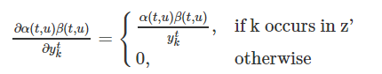

# 损失函数


## 损失函数的定义


$$L(S) = -\ln\prod_{(x,z)\in S} p(z|x) = -\sum_{(x,z)\in S} \ln p(z|x)$$


其中S为训练集。损失函数可以解释为：给定样本后输出正确label的概率的乘积，再取负对数就是损失函数了。取负号之后我们通过最小化损失函数(说白了就是一个似然函数损失)，就可以使输出正确的label的概率达到最大了。

由于上述定义的损失函数是可微的，因此我们可以求出它对每一个权重的导数，然后就可以使用什么梯度下降系列的算法来进行优化求解。

下面我们就要把上一节定义的前向变量与反向变量用到我们的损失函数中去,令序列$l=z$, 定义$X(t,u)=\{\pi \in A^{'T}: F(\pi)=z\pi_t=Z_u^{'}\}$,$X(t,u)$代表了在时刻t进经过label：$l_u^{'}$的所有路径的集合，这样由之前对前向变量和后向变量的定义，他俩的乘积就可以写成：

$$\alpha(t,u)\beta(t,u) = \sum_{\pi \in X(t,u)} \prod_{t=1}^Ty_{\pi_t}^t$$

而$p(\pi|x)=\prod_{t=1}^T(y_k^t)$,因而进一步转化可以得到：

$$\alpha(t,u)\beta(t,u) = \sum_{\pi \in X(t,u)}p(\pi|x)$$

因此，对于任意时刻t，我们给定输入x,输出序列z的概率可以表示为：

$$p(z|x)=\sum_{u=1}^{|z^{'}|}\alpha(t,u)\beta(t,u)$$

也就是在任意时刻分开，前向变量和反向变量的乘积为在该时刻经过label:$l_u^{'}$的所有概率之和。

损失函数就改写为：

$$L(x,z) = -\ln \sum_{u=1}^{|z^{'}|}\alpha(t,u)\beta(t,u) $$

## 损失函数的梯度计算(BPTT)

损失函数关于网络输出$y_{k}^t$的偏导数：

$$\frac{\partial L(x,z)}{\partial y_k^{t}}=-\frac{\partial \ln p(z|x)}{\partial y_k^{t}}=-\frac{1}{p(z|x)}\frac{\partial p(z|x)}{\partial y_k^{t}}$$

而$p(z|x)=\sum_{u=1}^{|z^{'}|}\alpha(t,u)\beta(t,u)= \sum_{\pi \in X(t,u)} \prod_{t=1}^Ty_{\pi_t}^t$,我们记label:k 出现在序列$z^{'}$的所有路径的集合为:$B(z,k)=\{u:z_u^{'}=k\}$,因而可以得到：


```{r fig.align = 'center',echo=FALSE,out.width="150%"}


```

即：

$$\frac{\partial p(z|x)}{\partial y_k^t}=\frac{1}{y_k^t}\sum_{u \in B(z,k)}\alpha(t,u)\beta(t,u)$$


可以得到损失函数对$y_{k}^{t}$的偏导数

$$ \frac{\partial L(x,z)}{y_{k}^{t}} = -\frac{1}{p(z|x)y_{k}^{t}}\sum_{u \in B(z,k)}\alpha(t,u)\beta(t,u)$$


最后：特别注意(softmax层)$$y_k^t = \frac{e^{a_k^t}}{\sum_{k^{'}}e^{a_{k^{'}}^t}}$$  

我们就得到损失函数关于$a_k^t$的偏导数：

$$\frac{\partial L(x,z)}{\partial a_k^t}= -\sum_{k^{'}}\frac{\partial L(x,z)}{\partial y_{k^{'}}^t}\frac{\partial y_{k^{'}}^t}{\partial a_k^t}$$


$$\frac{\partial L(x,z)}{\partial a_k^t}= y_{k}^t-\frac{1}{p(z|x)}\sum_{u\in B(z,k)}\alpha(t,u)\beta(t,u)$$

注:最后式子的推导见附加页


可以使用BPTT算法得到损失函数对神经网络参数的偏导。


